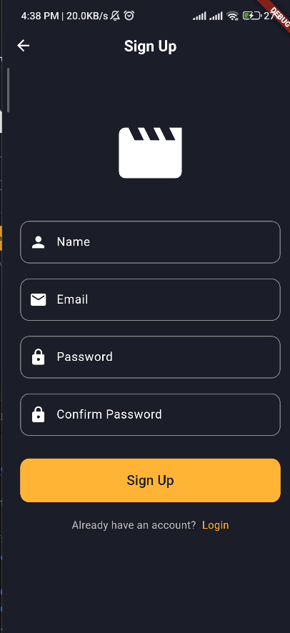
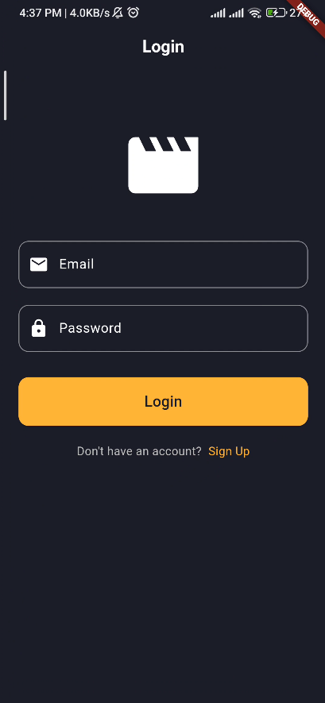
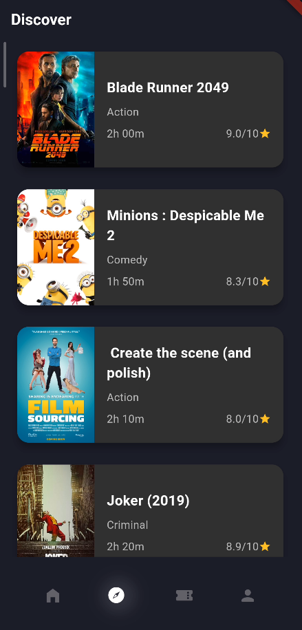
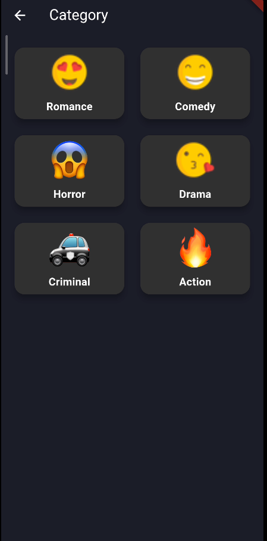
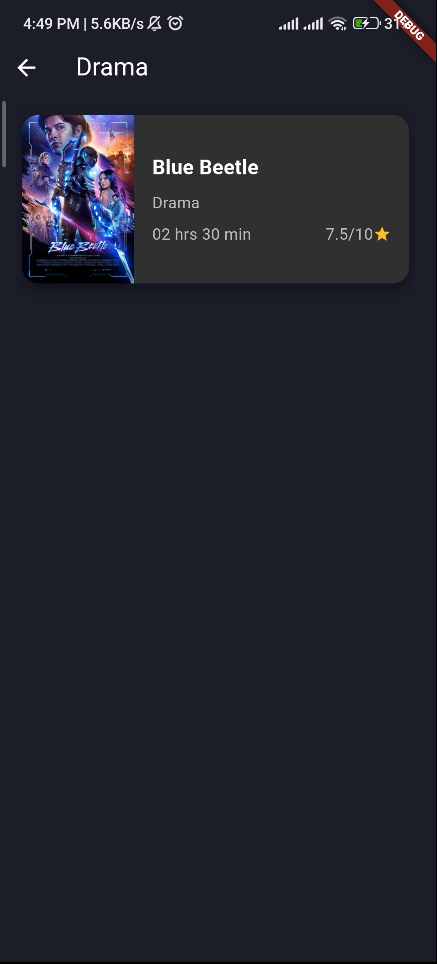
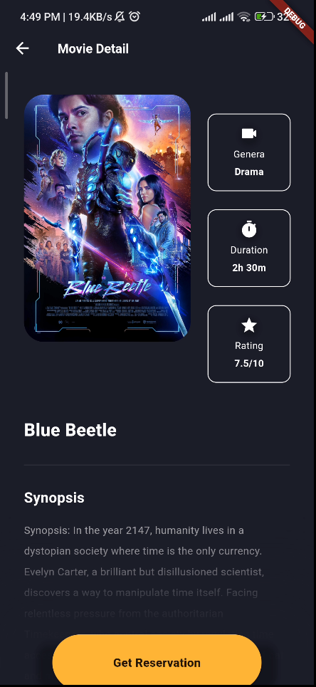
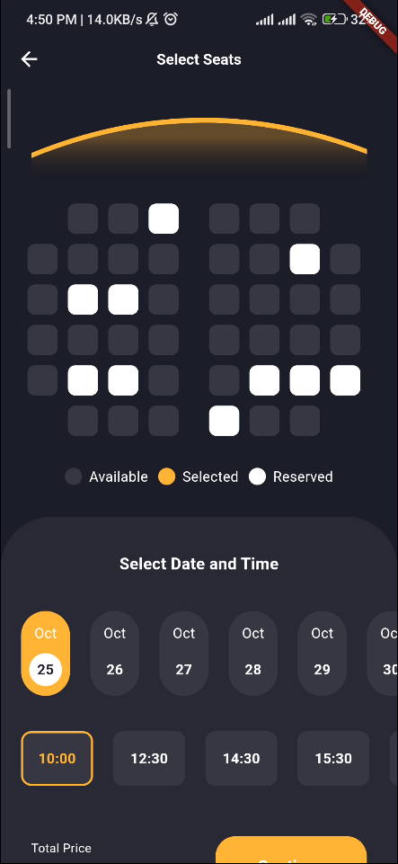
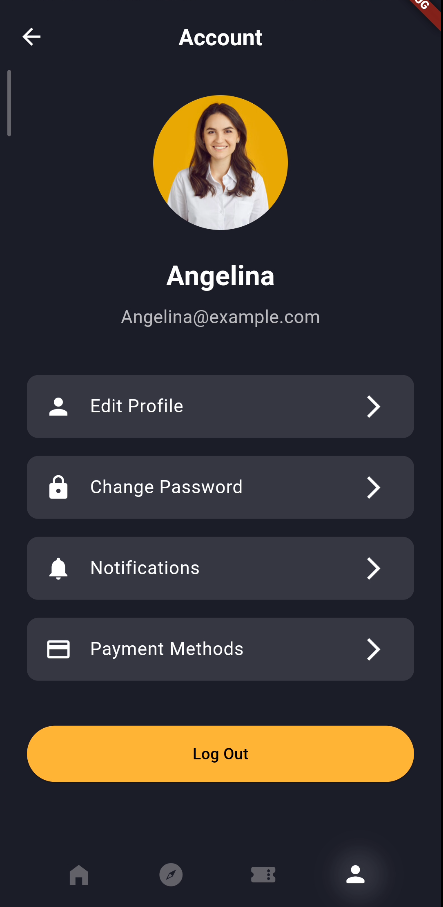

# Flutter Cinema Booking UI

Welcome to the Flutter Cinema Booking UI project! This application is designed to provide an engaging and user-friendly cinema ticket booking experience.

## Table of Contents

- [Flutter Cinema Booking UI](#flutter-cinema-booking-ui)
  - [Table of Contents](#table-of-contents)
  - [Getting Started](#getting-started)
    - [Prerequisites](#prerequisites)
    - [Running the Application](#running-the-application)
  - [Features](#features)
  - [Screenshots](#screenshots)
  - [Contribution](#contribution)
  - [License](#license)
  - [Contact](#contact)

## Getting Started

This project is a starting point for a Flutter application focused on creating a cinema ticket booking interface.

### Prerequisites

- Flutter SDK: [Install Flutter](https://flutter.dev/docs/get-started/install)
- Dart SDK: Included with Flutter
- IDE with Flutter support (e.g., Android Studio, IntelliJ, VS Code)

1. Clone the repository:

    ```bash
    git clone https://github.com/IlhamGhaza/flutter_cinema_booking_ui.git
    ```

2. Navigate to the project directory:

    ```bash
    cd flutter_cinema_booking_ui
    ```

3. Get the dependencies:

    ```bash
    flutter pub get
    ```

### Running the Application

1. Connect a device or start an emulator.
2. Run the application:

```markdown
    flutter run
```

## Features

- Display of currently showing movies
- Interactive cinema seat selection
- Easy ticket booking process
- Attractive and responsive user interface

## Screenshots

| Feature                | Screenshot                                      |
|------------------------|-------------------------------------------------|
| Signup                 |                |
| Login                  |                  |
| Home                   |                    |
| Discover               |            |
| Category               |            |
| Category Movie         | |
| Movie Details         |    |
| Seat Selection         | |
| Account Page           |    |

## Contribution

We greatly appreciate your contributions! If you would like to contribute to this project, please create a pull request or open an issue for discussion.

## License

This project is licensed under the Creative Commons Attribution-NonCommercial 4.0 International Public License - see the [LICENSE](LICENSE) file for details.

## Contact

If you have any questions or suggestions, feel free to contact us at [email](mailto:cb7ezeur@selenakuyang.anonaddy.com).

Thank you for using Flutter Cinema Booking UI!
